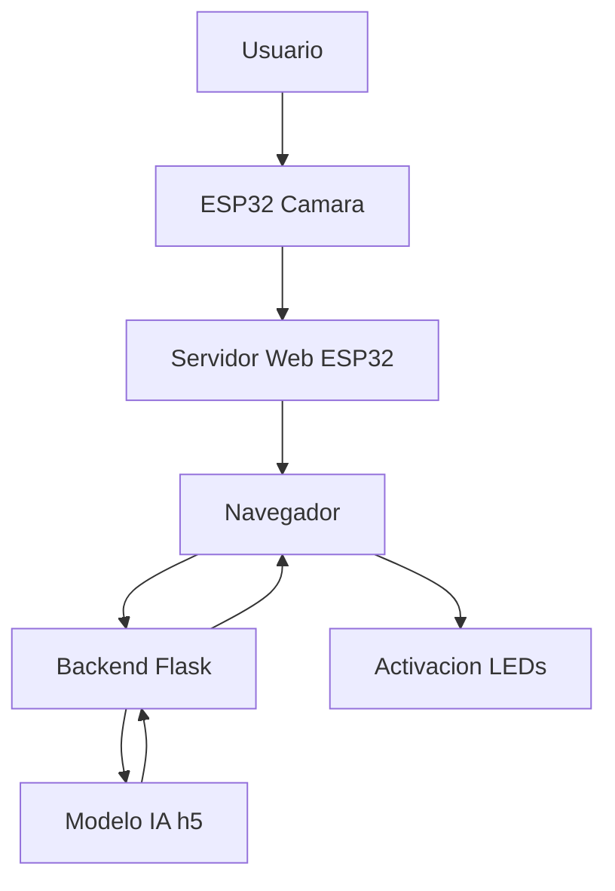

# ♻️ CamCan

### 🚀 Sistema inteligente de clasificación de residuos con IA, ESP32 y visión por computadora


---

## 🎥 Demo

> 📌 Agrega aquí un GIF del sistema funcionando (muy recomendado)

---

## 📌 Descripción

**CamCan** es un sistema embebido inteligente que combina:

* 📸 Visión por computadora
* 🧠 Inteligencia Artificial
* 🔌 Hardware de bajo costo

para clasificar residuos en tiempo real en:

* 🟦 **Caneca Blanca** → reciclables
* ⬛ **Caneca Negra** → no reciclables
* 🟩 **Caneca Verde** → orgánicos

---

## 🧠 Arquitectura del sistema



---

## ⚙️ ¿Cómo funciona?

1. 📸 El **ESP32-S3** captura la imagen
2. 🌐 Sirve una interfaz web (`camera_index.html`)
3. 📱 El usuario accede escaneando un **QR en pantalla OLED**
4. 📡 La imagen se envía al backend en base64
5. 🧠 El modelo de IA procesa la imagen
6. 📊 Se obtienen probabilidades por clase
7. 💡 Se activa el LED correspondiente

---

## 🔌 Hardware utilizado

* ESP32-S3 con cámara
* Pantalla OLED (I2C)
* 3 LEDs indicadores
* Conexión WiFi

### 💡 Pines de LEDs

* 🟦 Blanca → GPIO **45**
* ⬛ Negra → GPIO **47**
* 🟩 Verde → GPIO **48**

---

## 📱 Interfaz del usuario

* Acceso mediante QR generado en tiempo real
* Interfaz web alojada en el ESP32
* Captura y envío automático de imagen
* Feedback visual con resultados

---

## 🧠 Inteligencia Artificial

* Modelo: **MobileNetV2 (Transfer Learning)**
* Framework: TensorFlow / Keras
* Entrada: imágenes 224x224
* Salida: probabilidades por clase

```json
{
  "index": 0,
  "probabilidades": [0.85, 0.10, 0.05]
}
```

---

## 🌐 Backend (Flask API)

### 📍 Endpoint principal

`POST /predict`

#### Entrada:

```json
{
  "imagen": "base64..."
}
```

#### Salida:

```json
{
  "index": 1,
  "probabilidades": [0.1, 0.8, 0.1]
}
```

---

### 📍 Endpoint de prueba

`GET /predict`

```json
{
  "status": "Servidor activo"
}
```

---

## 📡 ESP32 (Firmware)

El ESP32:

* Captura imágenes (`esp_camera`)
* Sirve la web (`app_httpd.cpp`)
* Genera QR dinámico con IP local
* Controla LEDs según clasificación
* Muestra información en OLED

---

## 📁 Estructura del proyecto

```bash
CameraWebServer/
│
├── CameraWebServer.ino      # Firmware ESP32
├── app_httpd.cpp            # Servidor web embebido
├── camera_index.h           # HTML embebido
├── camera_index.html        # Interfaz web
├── camera_pins.h            # Configuración de cámara
│
├── app.py                   # Backend Flask
├── clasificador_canecas.h5  # Modelo IA
│
├── modelo.py                # Entrenamiento
├── residuos.py              # Dataset
├── toTensorlite.py          # Conversión modelo
│
├── convertir_a_h.py         # HTML → header
├── convertir_a_html.py      # Header → HTML
│
├── partitions.csv           # Configuración memoria
└── ci.json                  # Configuración adicional
```

---

## 🎯 Características principales

✅ Sistema completamente local (sin nube)
✅ Acceso mediante QR automático
✅ Clasificación en tiempo real
✅ Integración hardware + software
✅ Feedback físico con LEDs
✅ Interfaz web embebida

---

## ⚠️ Limitaciones

* Solo clasifica **un objeto a la vez**
* Puede fallar con múltiples objetos
* Dependiente del dataset de entrenamiento

---

## 🚀 Futuras mejoras

* 🔥 Detección de múltiples objetos (YOLO)
* 🎤 Integración con asistentes de voz
* 🤖 Clasificación automática continua
* 📊 Estadísticas de uso
* ♻️ Sistema físico de separación

---

## 📦 Instalación

### Backend

```bash
pip install flask flask-cors pillow numpy tensorflow
python app.py
```

---

### ESP32

1. Abrir `CameraWebServer.ino` en Arduino IDE
2. Configurar WiFi
3. Subir al ESP32
4. Escanear QR en pantalla

---

## 🌱 Impacto

CamCan busca mejorar la cultura de reciclaje mediante tecnología accesible, demostrando cómo la IA puede aplicarse en problemas ambientales reales.

---

## 👨‍💻 Autor

**Nicolás Alfonso Alvarado Medina**
GitHub: https://github.com/Elnico1836

---

## ⭐ Apoya el proyecto

Si te gustó:

⭐ Dale estrella al repositorio
🔁 Compártelo
🛠️ Contribuye

---

## 📜 Licencia

Uso educativo.
